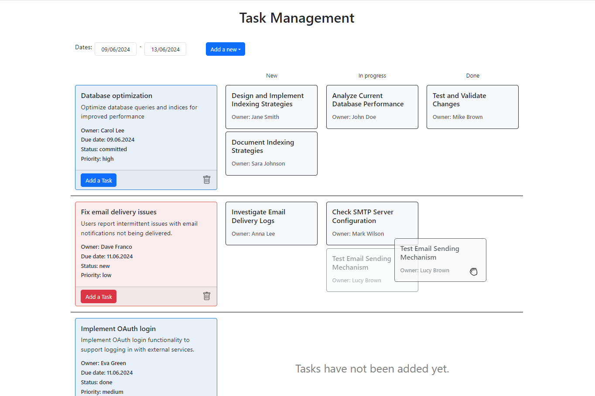

# Task Management



Task Management is a task management application that allows users to create, edit, delete, and manage different tasks under tickets and bugs.

## Key Features

- Create and edit tickets and bugs
- Add, edit, and delete tasks under each ticket/bug
- Visual display of tasks in three columns: new, in progress, done
- Change task status via drag and drop
- Support for optimistic updates
- Filter tickets and bugs by due dates

## Technologies Used

- **Frontend**: React, Redux Toolkit, Formik, React-Bootstrap, date-fns, react-datepicker, react-dnd, react-dnd-html5-backend, react-spinners, Yup
- **Backend**: Express, MongoDB, Mongoose

## Installation

### Prerequisites

- Node.js
- MongoDB

### Installation Steps

1. Clone the repository:

   ```bash
   git clone https://github.com/avner84/Task-Management-JS.git
   cd Task-Management-JS
   ```

2. Install dependencies for the Backend:

   ```bash
   cd backend
   npm install
   ```

3. Install dependencies for the Frontend:

   ```bash
   cd ../frontend
   npm install
   ```

### Environment Configuration

#### Backend

In the root directory of `backend`, create a `.env` file and add the following lines:

   ```bash
   MONGODB_URI=<your-mongodb-uri>
   ```

In the `config` directory within the root of `backend`, you can edit the `default.js` file and adjust the following details as needed:

   ```javascript
   module.exports = {
       port: 8080,
       protocol: "http",
       host: "localhost",
       origin: `http://localhost:3000`, // CLIENT_URL
       api: `http://localhost:8080`, // API_URL
   };
   ```

#### Frontend

In the `config` directory within the `src` of `frontend`, you can edit the `default.js` file and adjust the following details:

   ```javascript
   const config = {
     API_URL: 'http://localhost:8080',
   };

   export default config;
   ```

### Running the Project

#### Backend

   ```bash
   cd backend
   node app.js
   ```

#### Frontend

   ```bash
   cd frontend
   npm start
   ```

## Project Structure

### Backend

- `app.js`: The main entry file of the server.
- `routers/`: Contains the API route files.
- `controllers/`: Contains the business logic for the API.
- `models/`: Contains the data models for MongoDB.
- `utils/`: Contains helper functions, including `databaseConnect.js` for connecting to the database.
- `config/`: Contains configuration files, including `default.js` for setting details like port and host.

### Frontend

- `src/`: Contains all the source code of the application.
- `redux/`: Contains the slices and thunks for state management.
- `components/`: Contains all the components of the application.
- `hooks/`: Contains custom hooks for interacting with Redux.
- `pages/`: Contains different pages of the application, including the `main` page where tasks are displayed and all application actions are centralized.

## How to Use

1. When entering the application, the user can select dates through the date picker at the top of the screen.
2. To add a ticket or bug, click the button next to the date picker and choose the appropriate type.
3. Tickets/bugs can be edited or deleted by clicking on them or on the trash icon at the bottom of the card.
4. To add a task to a ticket/bug, click the "Add a Task" button at the bottom of the card.
5. Each task is displayed as a small card in columns based on its status. Tasks can be edited or deleted by clicking on them.
6. Task status can be changed by dragging it to the relevant column or by regular editing.

## Contact

If you have any further questions or need assistance, feel free to contact me via email at avner84@gmail.com.
